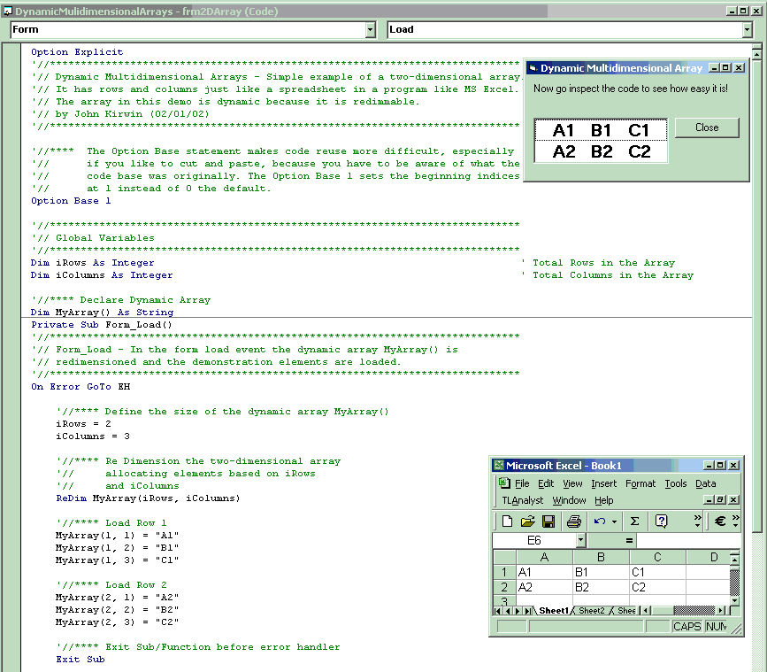



## Dynamic Multidimensional Arrays

### Description

This is a fully commented simple example of a two-dimensional array with rows and columns just like a spreadsheet in a program like MS Excel.
 
### More Info
 

             |
---                |---
**Submitted On**   |2002-02-01 21:00:16
**By**             |[John C Kirwin](https://github.com/Planet-Source-Code/PSCIndex/blob/master/ByAuthor/john-c-kirwin.md)
**Level**          |Intermediate
**User Rating**    |5.0 (25 globes from 5 users)
**Compatibility**  |VB 5\.0, VB 6\.0
**Category**       |[Data Structures](https://github.com/Planet-Source-Code/PSCIndex/blob/master/ByCategory/data-structures__1-33.md)
**World**          |[Visual Basic](https://github.com/Planet-Source-Code/PSCIndex/blob/master/ByWorld/visual-basic.md)
**Archive File**   |[Dynamic\_Mu52355212002\.zip](https://github.com/Planet-Source-Code/john-c-kirwin-dynamic-multidimensional-arrays__1-31404/archive/master.zip)

